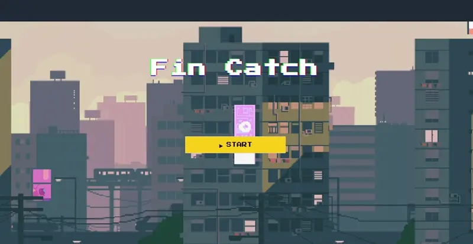
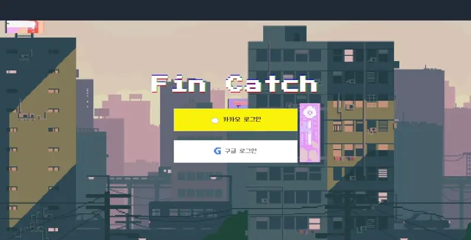
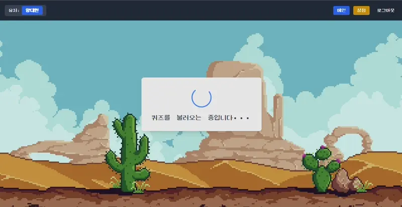
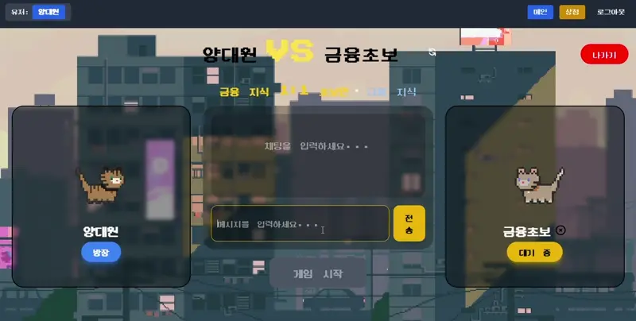
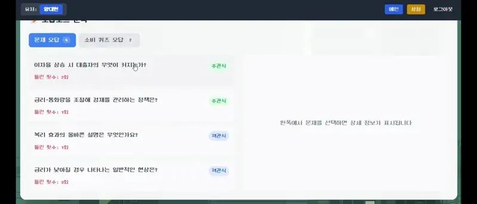
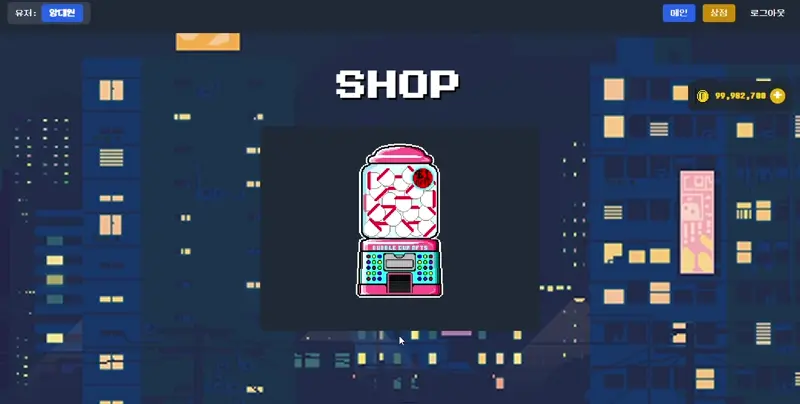
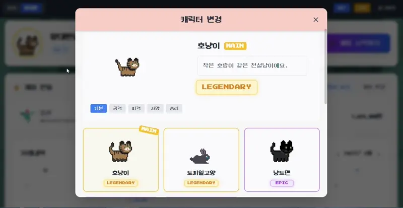
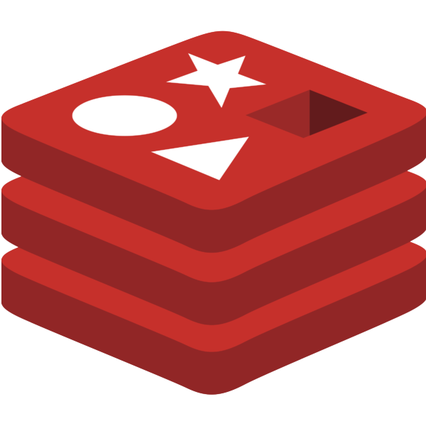
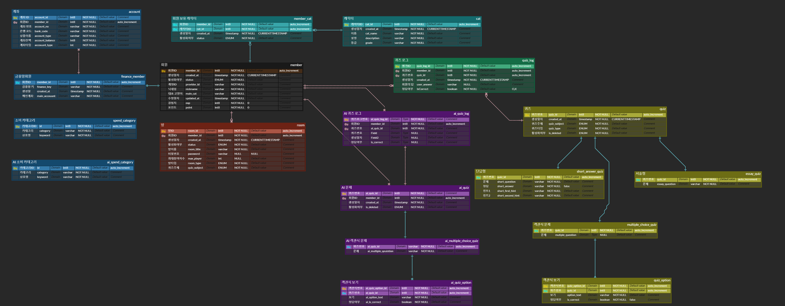

<div align="center">

# Fin catch 😸

**개인 맞춤형 금융 교육 서비스**

**FinCatch**는 사용자의 소비 데이터를 분석하여 금융 습관을 시각적으로 제공합니다.

 **맞춤형 금융 교육 콘텐츠**를 제공하여 사용자의 관심 분야를 공부할 수 있습니다.

개인의 소비 패턴을 **분석, 학습 방향을 제안**합니다.

금융 배틀을 통해 포인트를 얻고 다양한 고양이를 획득하세요!

[Fin catch 이용하기](http://j12d108.p.ssafy.io)

[노션 바로가기](https://apricot-bunny-1cb.notion.site/FinCatch-1a4faf2ac15080329d55f99fe2cb0490?pvs=74)

</div>


# 📑 목차 
- [주요 기능](#-주요-기능)
- [기술 스택](#️-기술-스택)
- [프로젝트 구조](#-프로젝트-구조)
- [설치 및 실행 방법](#️-설치-및-실행-방법)
- [담당 파트](#-담당-파트)


# 🚀 주요 기능

## 💻 화면
### 1. 메인화면


### 2. Oauth 로그인


### 3. 소비 패턴 분석


### 3-1. AI 소비 분류


### 4. 소비 패턴 퀴즈


### 5. 사용자 대결 


### 6. 오답 노트


### 7. 캐릭터 뽑기


### 8. 캐릭터 선택



## 🛠️ 기술 스택

### 💻 프론트엔드
<table>
  <tr>
    <td> JavaScript</td>
    <td> React.js</td>
  </tr>
</table>

### ⚙️ 백엔드
<table>
  <tr>
    <td> SpringBoot</td>
    <td> Hibernate</td>
    <td> FastAPI</td>
    <td> SpringSecurity</td>
  </tr>
</table>

### 🗄️ 데이터베이스
<table>
  <tr>
    <td> PostgreSQL</td>
    <td> Redis</td>
  </tr>
</table>

### ☁️ 인프라
<table>
  <tr>
    <td> AWS</td>
    <td> Docker</td>
    <td> Nginx</td>
    <td> Jenkins</td>
    <td> SonarQube</td>
  </tr>
</table>

### 🔭 모니터링
<table>
  <tr>
    <td> Prometheus</td>
    <td> Grafana</td>
    <td> Loki</td>
  </tr>
</table>

## 📂 프로젝트 구조

### 📦 프론트엔드
```
src/
├── assets/
├── components/
├── pages/
├── constants/
├── store/
├── api/
├── pages/
└── data/
```

### 🖥️ 백엔드
1. Spring Boot
```
finbattle/
├── domain/                   # 도메인 기반 비즈니스 로직 모음
│   ├── ai/                   # AI 추천, 분석 기능
│   ├── banking/              # 금융/거래 처리 로직
│   ├── cat/                  # 고양이 정보 관리 및 연결
│   ├── chat/                 # 채팅 기능
│   ├── game/                 # 게임 기능 처리
│   ├── member/               # 회원 정보 및 인증 관리
│   ├── oauth/                # OAuth 인증 처리
│   ├── quiz/                 # 퀴즈 기능
│   ├── room/                 # 채팅방/게임방 관리
│   └── token/                # JWT/AccessToken 관련 처리
│
├── global/
│   └── common/               # 전역 공통 모듈
│       ├── config/           # 애플리케이션 설정 (WebMvc, Security 등)
│       ├── exception/        # 전역 예외 처리
│       ├── filter/           # 인증 필터 등 서블릿 필터
│       ├── handler/          # 인증 실패, 예외 핸들러
│       ├── metrics/          # Prometheus, Grafana 메트릭 연동
│       ├── model/            # 공통 모델 및 DTO
│       ├── redis/            # Redis 캐싱, 저장소
│       ├── service/          # 공용 서비스 계층
│       └── Util/             # 유틸 클래스 모음 (DateUtil, StringUtil 등)
│
└── FinbattleApplication.java # 스프링부트 메인 실행 클래스

```

2. AI
```
ai/
├── app/
│   ├── models/
│   │   ├── best_booster.model
│   │   ├── category_mapping.joblib
│   │   ├── final_vectorizer.joblib
│   │   ├── label_encoder.joblib
│   │   ├── vectorizer.joblib
│   ├── __init__.py
│   ├── main.py
├── requirements.txt
```

### 🏗️ 아키텍처


### 📚 ERD


### ⚙️ 설치 및 실행 방법
```bash
# Frontend
cd frontend
npm install
npm run dev

# Backend
cd backend
./gradlew bootRun
```


## ✨ 담당 파트
<table>
  <tr>
    <td align="center">
      <a href="https://github.com/thegr8od"></a>
      <br />
      <strong>김승준</strong>
      <br />
      😎 Reader | 🔧 BE 
    </td>
    <td align="center">
      <a href="https://github.com/YDaewon"></a>
      <br />
      <strong>양대원</strong>
      <br />
      🔧 BE | 🛠 Infra
    </td>
    <td align="center">
      <a href="https://github.com/DonghyeonKwon"></a>
      <br />
      <strong>권동현</strong>
      <br />
      🔧 BE | 🛠 Infra
    </td>
    <td align="center">
      <a href="https://github.com/KimByeongNyeon"></a>
      <br />
      <strong>김병년</strong>
      <br />
      💻 FE
    </td>
    <td align="center">
      <a href="https://github.com/kim13245"></a>
      <br />
      <strong>김세현</strong>
      <br />
      💻 FE
    </td>
    <td align="center">
      <a href="https://github.com/cosmos2123"></a>
      <br />
      <strong>김태호</strong>
      <br />
      💻 FE
    </td>
  </tr>
</table>


### 공통 파트
- Git 컨벤션 준수
- 코드 리뷰 진행
- 기술 문서 작성

### 회고
김승준
```
일한거 기록
```
------------------------------------------------
본인 할말 작성


양대원
```
일한거 기록
```
------------------------------------------------
본인 할말 작성


권동현
```
일한거 기록
```
------------------------------------------------
본인 할말 작성


김병년
```
일한거 기록
```
------------------------------------------------
본인 할말 작성


김세현
```
일한거 기록
```
------------------------------------------------
본인 할말 작성


김태호
```
일한거 기록
```
------------------------------------------------
본인 할말 작성


📌 기타 정보
API 문서
